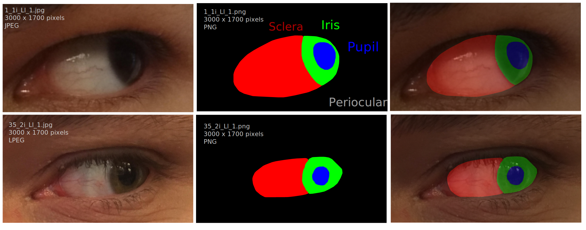

# **M**obile **O**cular **B**iometrics **I**n **U**nconstrained **S**ettings

Full dataset (~3.5GB): this includes all the 16,717 RGB images from 100 subjects, including the ones without any corresponding segmentation markups, saved as multiclass (multi-coloured) masks.
Of these subjects, 3559 (belonging to 35 subjects) are considered the segmentation subset, and are annotated with the sclera, iris, pupil, and periocular region.
See further details here https://sclera.fri.uni-lj.si/datasets.html


## Samples



## Details 
Each image in the dataset is labeled as:
`<ID>_<phone><light>_<Eye><gaze>_<number>.jpg`

- `ID`: Subject ID (1–100)
- `phone`
	- **1**: Sony Xperia Z5 Compact
	- **2**: Apple iPhone 6s
	- **3**: Xiaomi Pocophone F1
- `light`
	- **i**: indoor
	- **n**: natural
	- **p**: poor
- `Eye`
	- **L**: left
	- **R**: right
- `gaze`
	- **l**: left
	- **r**: right
	- **s**: straight
	- **u**: up
- `number`
	- **1 or 2**: number of image in the current set
	- **bad**: deliberately unusable image (for quality control)

The multiclass segmentation masks are named the same as their corresponding original files, but with the '.png' extension. The colours in the masks correspond to the different regions, specifically:

- <span style="color:red">**Sclera**</span>: `RGB(255, 0, 0)`
- <span style="color:green">**Iris**</span>: `RGB(0, 255, 0)`
- <span style="color:blue">**Pupil**</span>: `RGB(0, 0, 255)`
- **Periocular**: `RGB(0, 0, 0)`

The dataset also comes bundled with a `data.csv` file, which contains extra information about the subjects in the dataset.


## File organisation
* tree 
```
$ tree
.
├── data.csv
├── Images
│   ├── 1
│   │   ├── 1_1i_Ll_1.jpg
│   │   ├── 1_1i_Ll_2.jpg
│   │   ├── 1_1i_Lr_1.jpg
│   │   ├── 1_1i_Lr_2.jpg

...


│       ├── 99_3p_Rs_bad.jpg
│       ├── 99_3p_Ru_1.jpg
│       ├── 99_3p_Ru_2.jpg
│       └── 99_3p_Ru_bad.jpg
├── Masks
│   ├── 1
│   │   ├── 1_1i_Ll_1.png
│   │   ├── 1_1i_Ll_2.png
│   │   ├── 1_1i_Lr_1.png
│   │   ├── 1_1i_Lr_2.png
│   │   ├── 1_1i_Ls_1.png


...

│       ├── 9_3p_Rr_1.png
│       ├── 9_3p_Rr_2.png
│       ├── 9_3p_Rs_1.png
│       ├── 9_3p_Rs_2.png
│       ├── 9_3p_Ru_1.png
│       └── 9_3p_Ru_2.png
└── README.md

137 directories, 20278 files

```

* tree human readable
```
$ tree -h
tree -d
.
├── Images
│   ├── 1
│   ├── 10
│   ├── 100
│   ├── 11
│   ├── 12
│   ├── 13
│   ├── 14
│   ├── 15
│   ├── 16
│   ├── 17
│   ├── 18
│   ├── 19
│   ├── 2
│   ├── 20
│   ├── 21
│   ├── 22
│   ├── 23
│   ├── 24
│   ├── 25
│   ├── 26
│   ├── 27
│   ├── 28
│   ├── 29
│   ├── 3
│   ├── 30
│   ├── 31
│   ├── 32
│   ├── 33
│   ├── 34
│   ├── 35
│   ├── 36
│   ├── 37
│   ├── 38
│   ├── 39
│   ├── 4
│   ├── 40
│   ├── 41
│   ├── 42
│   ├── 43
│   ├── 44
│   ├── 45
│   ├── 46
│   ├── 47
│   ├── 48
│   ├── 49
│   ├── 5
│   ├── 50
│   ├── 51
│   ├── 52
│   ├── 53
│   ├── 54
│   ├── 55
│   ├── 56
│   ├── 57
│   ├── 58
│   ├── 59
│   ├── 6
│   ├── 60
│   ├── 61
│   ├── 62
│   ├── 63
│   ├── 64
│   ├── 65
│   ├── 66
│   ├── 67
│   ├── 68
│   ├── 69
│   ├── 7
│   ├── 70
│   ├── 71
│   ├── 72
│   ├── 73
│   ├── 74
│   ├── 75
│   ├── 76
│   ├── 77
│   ├── 78
│   ├── 79
│   ├── 8
│   ├── 80
│   ├── 81
│   ├── 82
│   ├── 83
│   ├── 84
│   ├── 85
│   ├── 86
│   ├── 87
│   ├── 88
│   ├── 89
│   ├── 9
│   ├── 90
│   ├── 91
│   ├── 92
│   ├── 93
│   ├── 94
│   ├── 95
│   ├── 96
│   ├── 97
│   ├── 98
│   └── 99
└── Masks
    ├── 1
    ├── 10
    ├── 11
    ├── 12
    ├── 13
    ├── 14
    ├── 15
    ├── 16
    ├── 17
    ├── 18
    ├── 19
    ├── 2
    ├── 20
    ├── 21
    ├── 22
    ├── 23
    ├── 24
    ├── 25
    ├── 26
    ├── 27
    ├── 28
    ├── 29
    ├── 3
    ├── 30
    ├── 31
    ├── 32
    ├── 33
    ├── 34
    ├── 35
    ├── 4
    ├── 5
    ├── 6
    ├── 7
    ├── 8
    └── 9

137 directories

```


