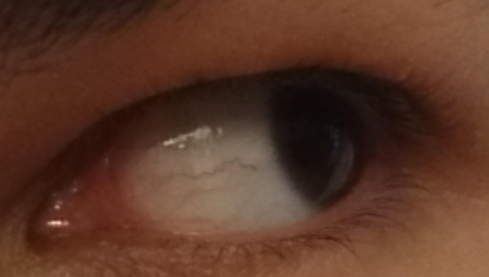
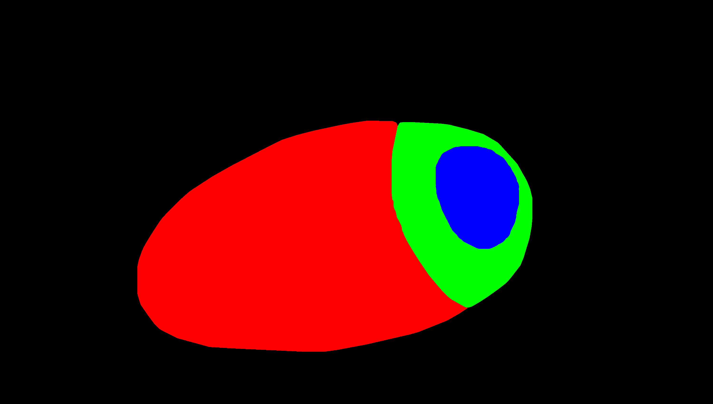
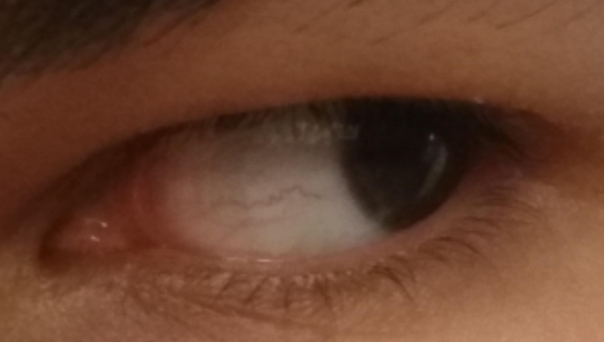
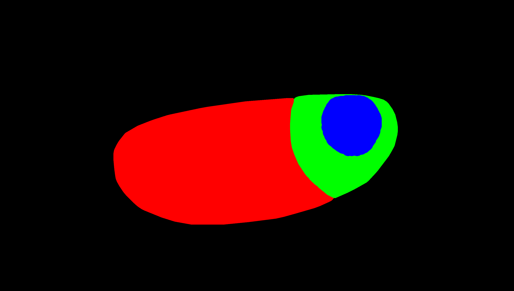
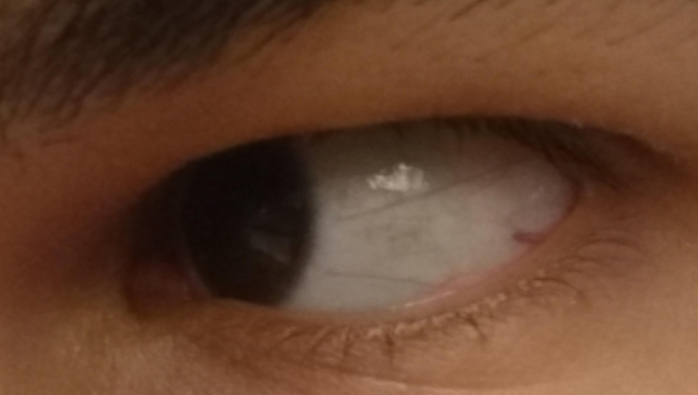
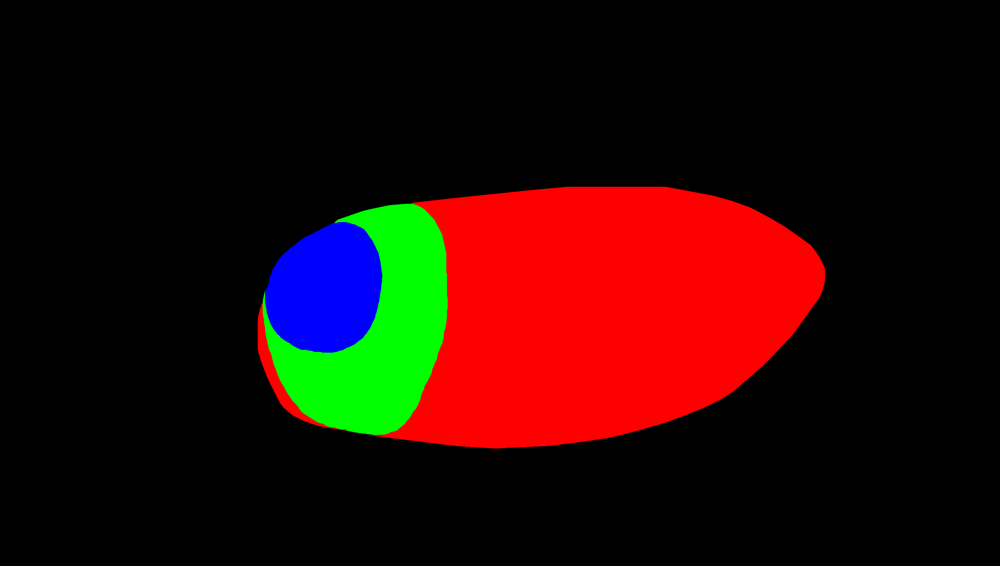
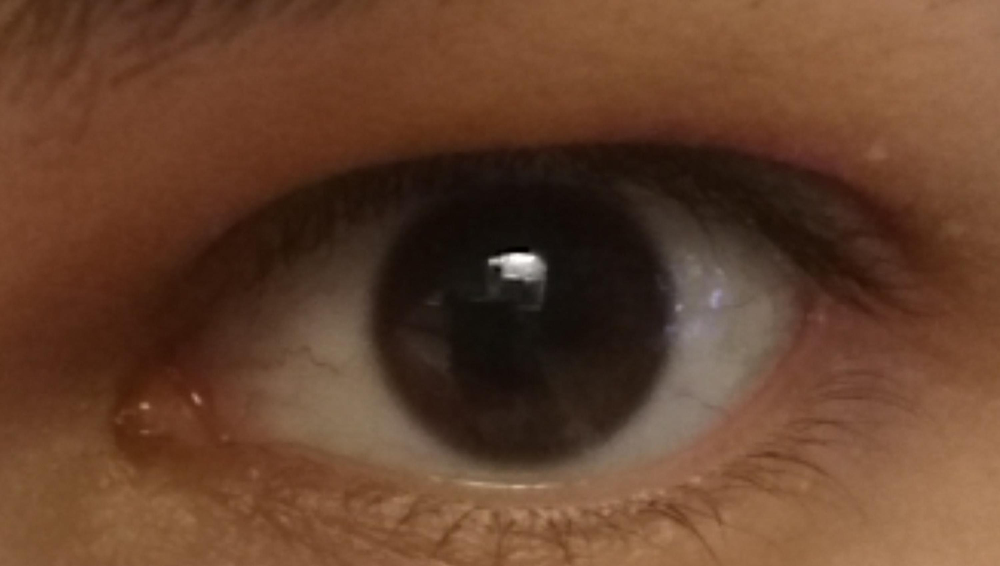
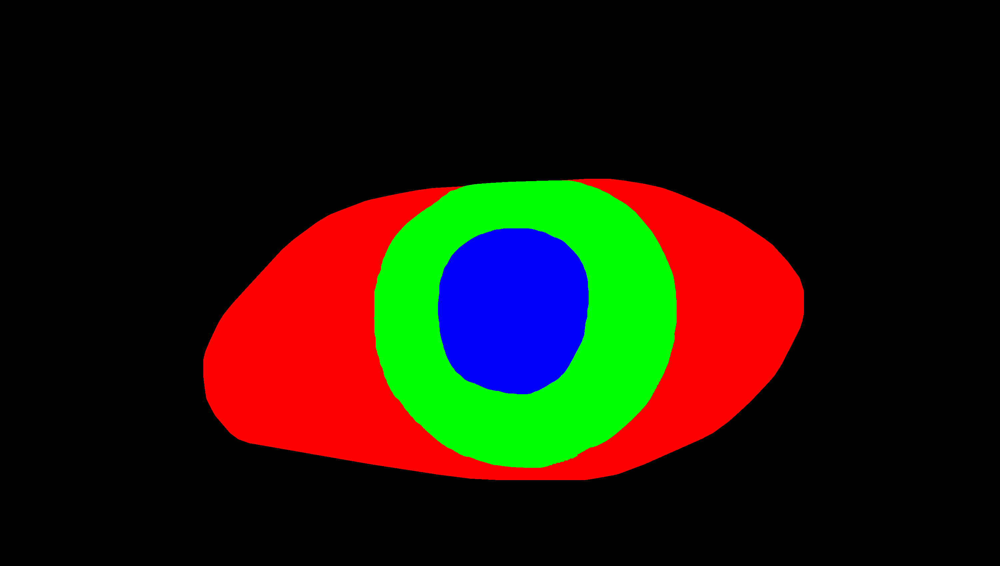

# Sample frames

## 3000 x 1700 pixels, 
* `1_1i_Ll_1`: 3000 x 1700 pixels, 
```
├── [137K]  1_1i_Ll_1.jpg
├── [ 24K]  1_1i_Ll_1.png
```
* 1_1i_Ll_1



* 1_1i_Ll_2



* 1_1i_Lr_2



* 1_1i_Ls_1



## 640 x 400 pixels
```
cd ~/data/bash-scripts
bash resize_images.bash ~/datasets/mobious/MOBIOUS
#mogrify -resize 640x400! *.jpg 
```
