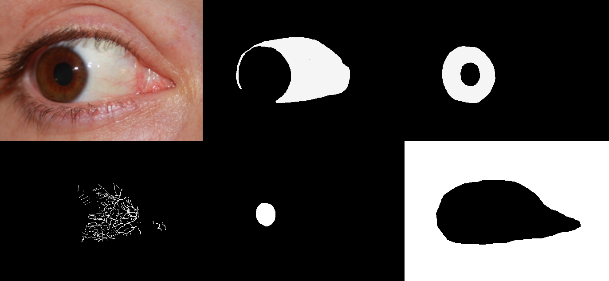

# SBVPI (Sclera Blood Vessels, Periocular and Iris) 

"SBVPI is a publicly available dataset designated primarily for research into sclera recognition, but it is also suitable for experiments with iris and periocular recognition techniques. It consists of 1858 high-resolution RGB images of eyes from 55 subjects. Images of the dataset were captured during a single recording session with a digital single-lens reflex camera (DSLR) (Canon EOS 60D) at the highest resolution and quality setting. Macro lenses were used to ensure sufficiently high-quality and visibility of fine details in the captured images. This procedure resulted in images with clearly visible scleral vasculature patterns, as shown in Figure 1." 

"Each sample in the database is labelled with an identity (one of 55), age (15–80), gender (male or female), eye (left or right), gaze direction (left, right, up, straight) and eye colour (brown, green, blue). Additionally, all 1858 images contain a manually-generated pixel-level ground truth markup of the sclera and periocular regions, as illustrated in Figure 3. A subset of 100–130 images (depending on the region) also contains a markup of the scleral vessels, the iris, the canthus, eyelashes, and the pupil. We used the GNU Image Manipulation Program (GIMP) to generate the ground-truth markups, which we included in SBVPI as separate images. Overall, the annotation process alone required roughly 500 man-hours of focused and accurate manual work. To conserve space, we later converted the markups into binary mask images, which (using lossless PNG compression) reduced the size of the entire dataset by a factor of approximately 6×. These masks are included in the final publicly available version of the dataset."

https://sclera.fri.uni-lj.si/datasets.html


Figure 1. Sample image from SBVPI with a zoomed in region that shows the sclera vasculature.


Figure 3: Each image has a set of corresponding per-pixel annotations (from left to right, top to bottom): RGB image, sclera, iris, vascular structures, pupil and periocular region.

## Obtaining the datasets
To obtain the SBVPI dataset, please download, fill out, and hand-sign this [SBVPI-licence-agreement form](../licence-agreements), and send it to Matej at matej.vitek@fri.uni-lj.si.

## Dataset details
SBVPI.zip is 5.0GB. See few samples [here](samples) and paths and file names.

* List paths
```
SBVPI$ ls
1   11  13  15  17  19  20  22  24  26  28  3   31  33  35  37  39  40  42  44  46  48  5   51  53  55  7  9
10  12  14  16  18  2   21  23  25  27  29  30  32  34  36  38  4   41  43  45  47  49  50  52  54  6   8
```

* List files for path 1
```
tree -h
[1.0M]  .
├── [ 35K]  1L_l_1_canthus.png
├── [ 96K]  1L_l_1_eyelashes.png
├── [ 37K]  1L_l_1_iris.png
├── [3.7M]  1L_l_1.jpg
├── [ 38K]  1L_l_1_periocular.png
├── [ 34K]  1L_l_1_pupil.png
├── [ 39K]  1L_l_1_sclera.png
├── [ 66K]  1L_l_1_vessels.png
├── [ 34K]  1L_l_2_canthus.png
├── [ 93K]  1L_l_2_eyelashes.png
├── [ 36K]  1L_l_2_iris.png
├── [3.8M]  1L_l_2.jpg
├── [ 37K]  1L_l_2_periocular.png
├── [ 33K]  1L_l_2_pupil.png
├── [ 36K]  1L_l_2_sclera.png
├── [ 63K]  1L_l_2_vessels.png

...

├── [ 51K]  1R_u_1_sclera.png
├── [ 84K]  1R_u_1_vessels.png
├── [4.1M]  1R_u_2.jpg
├── [ 45K]  1R_u_2_periocular.png
├── [ 50K]  1R_u_2_sclera.png
├── [1.8M]  1R_u_3.jpg
├── [ 28K]  1R_u_3_periocular.png
├── [ 32K]  1R_u_3_sclera.png
├── [1.8M]  1R_u_4.jpg
├── [ 29K]  1R_u_4_periocular.png
└── [ 33K]  1R_u_4_sclera.png

0 directories, 149 files
```